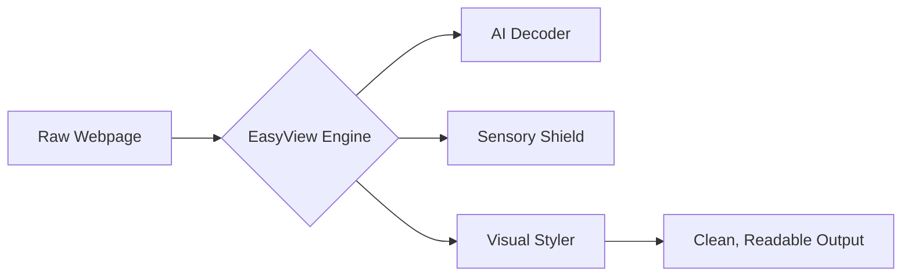

   

  # **⚛️EasyView** - **Clarity for Every Brain**

  **"Not every mind experiences the web the same way."**

  
  
  
  

---

## 🌊 The Problem: A Shouting Web
**The web wasn't designed for every brain.**

| Visual Stability | Distraction Removal | Sensory Balance|
|---|---|---|
||||

Imagine trying to hear a gentle whisper while standing in the middle of a construction site. 

For millions of people with **Dyslexia, ADHD, and Autism**, the modern web is that construction site. It's a chaotic landscape of flashing ads, overwhelming jargon, and rigid layouts. What should be a simple search for information becomes a mountain of cognitive friction. 

**The impact?** Lost confidence, missed educational opportunities, and mental exhaustion. When the digital world isn't built for your brain, every click feels like a battle.

> *"What should take seconds becomes mentally exhausting."*

---

## ✨ The Solution: Web, Adapted
**EasyView adapts the web to you.** We don't believe users should have to work harder to understand the internet. Instead, we've built an AI-powered bridge that translates the "shouting" web into a calm, structured, and personalized experience.

   
### **The Transformation**
| **Before EasyView** | **After EasyView** |
| :--- | :--- |
| Overwhelming text blocks | Structured, dyslexia-friendly layout |
| Confusing legal/technical jargon | Plain English definitions |
| Distracting animations & popups | A quiet, sensory-shielded space |

---

## 🚀 Key Features

### 🧠 **Reading Support**
*   **Dyslexia-Friendly Fonts:** Instant injection of OpenDyslexic and other high-readability typefaces.
*   **Bionic Reading:** Guided fixation points that lead your eyes through sentences effortlessly.
*   **Smart Spacing:** Dynamically adjust line-height and word-spacing to prevent "text-blurring."

### 🤖 **AI Understanding (Powered by Amazon Nova)**
*   **Jargon Decoder:** Real-time translation of complex legal, financial, and medical terms.
*   **One-Click Simplification:** Transform dense paragraphs into 6th-grade level summaries.
*   **Contextual Tooltips:** Hover over complex words for instant, simple explanations.

### 🛡️ **Sensory Control**
*   **Sensory Shield:** Instantly freeze distracting animations, transitions, and auto-playing videos.
*   **Focus Mode:** Strip away sidebars and headers to leave only the content that matters.

### 🎨 **Visual Customization**
*   **Color Overlays:** Reduce visual stress with tinted overlays (Sepia, Cool Blue, Soft Green).
*   **High Contrast:** One-tap accessibility themes for low-vision support.

### 📄 **Content Freedom**
*   **Universal Reader:** An isolated, distraction-free environment for deep reading.
*   **Multi-Format Export:** Save transformed content to **EPUB, DOCX, or HTML** for offline study.

---

## 📸 Experience EasyView

<table>
  <tr>
    <td>
      
    </td>
    <td>
      
    </td>
  </tr>
</table>

---

## ⚙️ How It Works

EasyView lives in your browser and acts as an intelligent filter between you and the raw code of the web.

1.  **Detect:** EasyView analyzes the DOM structure as the page loads.
2.  **Filter:** Distractions are neutralized, and AI identifies "high-friction" content.
3.  **Transform:** Personalized visual and linguistic changes are applied in real-time.

---

## 💎 Advanced Support (Premium)
*"Accessibility is not one-size-fits-all."*

Upgrade to **EasyView Premium** for the most advanced cognitive tools:
*   **ADHD Specialized Fonts:** Research-backed typefaces for maximum focus.
*   **Unlimited AI Decoding:** No quotas on Jargon decoding or text simplification.
*   **Advanced Sensory Modes:** Deep-level neutralization of modern web motion.

---

## 🛠️ Tech Stack

*   **Frontend:** JavaScript, React, Tailwind CSS
*   **Core:** Chrome Extension APIs (Manifest V3)
*   **Intelligence:** AWS Bedrock / Amazon Nova AI
*   **Backend:** Supabase (Auth, DB, Payments)

---

## ❤️ Why This Matters
Technology should not exclude people based on how their brain works. Every time a student with dyslexia can't read their assignment, or an elderly user gets confused by a bank's terms of service, we have failed.

**EasyView is our commitment to a web where everyone is invited.**

---

## 🗺️ Roadmap
- [ ] **Hyper-Personalization:** AI that learns your specific reading speed and adjusts spacing.
- [ ] **Mobile Companion:** Bring cognitive clarity to iOS and Android.
- [ ] **Voice Navigation:** Control the web using simple, natural language.
- [ ] **Collaborative Dictionary:** Community-sourced definitions for niche jargon.

---

## 👥 The Team
Built with passion by **Team ThinkTech**.

---

## 🏁 Try EasyView Now
Ready to experience a clearer web?

[**Install from Chrome Web Store**](https://chromewebstore.google.com/detail/easyview/fkmaolnondclckcdeeanjophpnhndgkk) | [**Watch the Demo**](https://easyview.vercel.app) | [**Read the Docs**](https://easyview.vercel.app/documentation)

 

  <b>Made with ❤️ for neurodivergent accessibility.</b>

